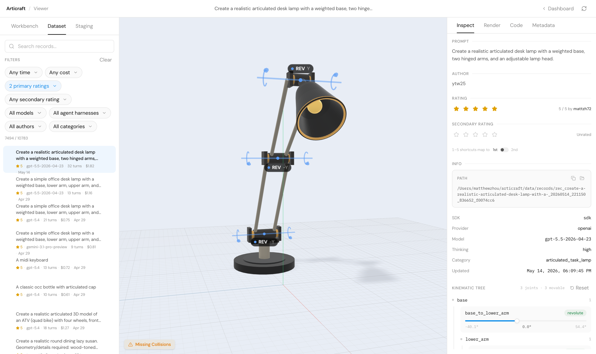

# 大模型写代码，1.2 万美元造出上万件“会动”的 3D 物体

> 剑桥、牛津等机构的研究者做了一套 3D 建模 Agent。它不盯着渲染图反复猜形状，而是写 Python、跑测试、修 Bug，最后交付带关节和运动范围的 URDF 资产。

给大模型一句话：“做一盏写实的桌面台灯，要有配重底座、两段铰接灯臂和可调灯头。”

普通文生 3D 系统或许能给你一张漂亮的静态网格。Articraft 交出的东西更像一台机器：底座、灯臂和灯头各有名字，转轴带方向和角度限制，生成结果可以导入机器人仿真器，也可以在 VR 里伸手拨动。

模型还会留下完整的 Python 源码和测试。灯头是否接在支架上，抽屉拉到最远时是否还卡在滑轨里，铰链转动后会不会穿过外壳，这些关系都能写成可执行的检查。

*图：Articraft 本地 Viewer。右侧既能查看生成提示、模型、成本和评分，也能拖动每个关节。图片来自项目仓库。*

这套系统来自剑桥大学、牛津大学和南洋理工大学等机构的研究团队。论文将其命名为 **Articraft**，研究者用它生产了 Articraft-10K：超过 1 万件经过人工筛选的关节 3D 资产，覆盖 245 个物体类别。[论文于 2026 年 5 月提交至 arXiv](https://arxiv.org/abs/2605.15187)。

## 3D 世界缺的，是物体“怎么动”

柜门、折叠椅、钳子、婴儿车都由多个零件组成。它们的用途取决于零件之间的运动关系。只保存外形，机器人仍不知道柜门绕哪根轴转，抽屉能拉多远，也不知道一把剪刀的两片刀刃怎样咬合。

这类信息通常写在 URDF 等结构化格式中。每个零件需要几何形状、层级关系和语义名称；每个关节还需要类型、原点、轴向与运动范围。建模者既要懂 3D 几何，也要懂机构和仿真。

训练数据却一直偏少。论文列出的 PartNet-Mobility 有约 2300 件关节物体、46 类；AKB-48 有约 2000 件、48 类。部分数据集的总规模很大，类别覆盖仍集中在少数物体上。机器人一旦遇到训练集外的新家电或工具，关节结构预测很容易失灵。

Articraft 团队把这个数据瓶颈改写成了一个编程问题：**让大模型编写一段能够“造出物体”的程序。**

这个选择利用了大模型已经具备的两种知识。代码模型知道怎样拆解任务、调用 API 和修复报错；语言模型也见过大量日常物体描述，知道台灯需要铰链，拉杆箱的把手需要伸缩，风扇叶片应绕电机轴旋转。研究者不再训练一个专用的 3D 生成网络，而是给现成的大模型配上一套适合它的工作台。

## 工作台上只有一个可写文件

Articraft 没有把整个代码仓库和一套复杂的图形软件扔给 Agent。它的虚拟工作区只有一个可编辑文件 `model.py`，旁边放着只读的 SDK 文档和示例。

`model.py` 有两个核心入口。`build_object_model()` 负责搭零件、几何和关节，`run_tests()` 负责写对象专属的检查。Agent 可以使用盒体、圆柱、球体等基础几何，也能调用放置、铰链、轮胎、格栅、扫掠和 CadQuery 等工具处理复杂形状。

一段台灯程序大致会做这些事：

1. 建立底座、下灯臂、上灯臂和灯头等语义零件。
2. 给零件添加可见几何与材质。
3. 用旋转关节连接零件，写明转轴与角度范围。
4. 添加接触、间隙和不同姿态下的几何测试。

Agent 能做的操作也受到限制。它可以读文件、打补丁、查示例、编译模型和探测几何数据，却不能随意执行 Shell 命令或改造仓库。编译工具会运行当前程序、生成 URDF，并检查单一根节点、悬空零件、意外重叠和网格问题。

反馈不会以几千行日志砸回模型。Harness 把结果整理成 `failure`、`warning` 和 `note`。如果拉杆箱把手离箱体还有 6 毫米，Agent 会收到“悬空零件”及近邻距离；如果轮轴有意插进轮毂，Agent 可以写一个带理由、限定到具体几何元素的重叠许可。

于是，一次生成变成了循环：

**写代码 → 编译与测试 → 读取结构化反馈 → 探测尺寸 → 修改代码。**

论文附录里有一条滚轮工具箱的真实轨迹。GPT-5.5 在 25 个回合中读取了 11 次文档，编译和几何探测各 5 次，打了 7 次补丁。系统先后发现连续关节限制错误、轮子悬空和拉杆重叠，最终把失败数与警告数都降到零。

这套设计还带来一个工程收益：核心生成循环不用渲染图片，也不用 Blender。`model.py` 执行、CAD 建模、网格处理、URDF 导出和质量检查都在 CPU 上完成。昂贵部分集中在大模型 API。

## 同一个 GPT-5.5，换个工作台，结果差出一截

研究团队从 PartNet-Mobility 的 46 个类别中各写 5 条提示词，把六种方法生成的结果随机交给 125 名大学生评价，共收回 5000 次比较。参与者依据提示词匹配度和整体质量选出前三名。

搭载 GPT-5.5 的 Articraft 有 **42%** 的结果被选为第一名，搭载 GPT-5.4 的版本为 **26%**。直接让 GPT-5.5 驱动通用 Codex 工具、自由编写 URDF 时，结果排在倒数第二。

底座模型相同，差异来自 Agent 和计算机之间的接口。专用 SDK 缩短了代码，受限工作区砍掉无关选择，编译器又把几何问题转换成模型能采取行动的反馈。论文的核心贡献也落在这里：大模型能力要通过合适的工具、状态和反馈格式才能落到专业任务上。

研究者还用同一条折叠四旋翼提示测试了 GPT-5.5、Gemini 3.1 Pro 和 Claude Opus 4.7。三个模型都还原了折叠臂、旋翼和可俯仰相机的运动结构，几何细节存在差异。单个案例中，GPT-5.5 从低推理强度调到高推理强度后，可见元素从 39 个增至 78 个。作者把这项消融定位为定性展示，没有把一条提示词包装成模型排行榜。

## 平均 1.14 美元，换来一件生成样本

Articraft-10K 的规模建立在一套清楚的成本账上。

主生成批次共运行 10,909 次。团队从几轮探索中总结出系统擅长的类别，再让大模型扩展候选清单，由人工审核并编写各类别提示词。生成完成后，标注者按整体几何、应有的运动是否存在、关节是否符合基本物理约束三个方面打 1 至 5 分。论文只把 4 星和 5 星对象计入最终数据集。

最终有 10,018 件资产通过筛选，保留率为 91.8%。其中 GPT-5.4 生成结果的保留率为 89.4%，GPT-5.5 为 95.5%，Gemini 3.1 Pro 为 96.3%。这些比例来自不同规模的生成批次，不能直接当作模型质量排名。

10,880 次带成本日志的生成合计花费 **12,386.99 美元**，平均每次 1.14 美元。最终保留对象对应约 11,330 美元，平均每件 1.13 美元。缓存承担了 85.7% 的提示词 Token，压低了重复加载系统提示和 SDK 文档的成本。一次生成平均需要 16.8 个 Agent 回合，中位数为 15。

每件保留资产都带有 URDF、`model.py` 和生成轨迹。研究者同时拿到提示词、工具调用、编译反馈、模型版本、成本、人工评分和代码哈希。这些记录让人能够追溯一件物体如何从第一版代码改到可接受版本，也为后续训练开源 3D Agent 留下了监督信号。

这里有一个容易混淆的口径。论文的最终集合统计 4 星和 5 星对象，因此应写作“超过 1 万件、245 类”。[当前公开数据仓库](https://github.com/mattzh72/articraft-data)的快照列出 10,788 条本地记录和 246 个类别目录，其中还可能保留低评分坏例、审计材料和后续记录。原始记录数不能直接替代论文的最终对象数。

## 这些数据能喂给模型，也能送进机器人

团队用 Articraft-10K 扩充 Particulate 的训练数据。Particulate 接收一个 3D 网格，预测零件划分、运动结构和关节参数。

在 Lightwheel 基准上，加入 Articraft 数据后，静止姿态分割的 gIoU 从 0.332 提升到 0.394；关节几何的 gIoU 从 0.305 升到 0.361。原训练分布之外的类别获益更明显。合成资产在这里没有充当展示样片，它们参与训练并改善了另一个模型的测试结果。

研究者也把生成的 URDF 直接导入 NVIDIA Isaac Sim，用 Franka 机械臂执行拉开抽屉等动作；在 VR 演示中，用户双手与物体碰撞后可以驱动对应关节。另一条管线结合 iPhone RoomPlan 和 LiteReality，把室内扫描中的家具逐件替换成带关节的生成资产，让重建房间中的柜门和抽屉可以活动。

这些演示说明了结构化 3D 资产的价值。一个物体只要带着零件树、碰撞几何和合法关节，就能在数据训练、物理仿真和交互应用之间复用。

## 编译通过，不代表看起来对

Articraft 的失败案例比成功图更能说明系统边界。

螺旋盖瓶的外壳可能已经变形，但网格仍然连通，瓶盖、瓶颈与旋转轴也通过了局部测试。滑板和旋转门同样可能避开悬空与碰撞错误，整体造型却不自然。喷壶扳机这类紧凑机构难以用现有 SDK 表达，运动时可能穿进瓶身。电饭煲和冰箱还会漏掉内部结构，或忘记把本该中空的外壳挖空。

结构检查擅长回答“零件是否连着”“这里是否相交”，却很难判断“它像不像一个真实电饭煲”。系统也没有穷举每个关节的全部姿态，因为密集采样会抬高生成成本。论文中的 91.8% 保留率依赖人工评分，人工策展属于数据生产流程的一部分。

开源仓库还给出了一条直接的安全提示：编译记录会执行生成的 `model.py`。用户只能运行可信来源的脚本。面向真实机器人时，团队也建议在目标环境中重新验证资产，几何或关节错误可能传递到下游控制系统。

## 论文之后，它已经长成一套本地工具

[开源仓库](https://github.com/mattzh72/articraft)把论文系统继续做成了 local-first 工作流。代码仓库保存 Agent、SDK、编译器和 Viewer，体积更大的公开数据单独存放。命令行已经覆盖生成草稿、重新运行、派生编辑、编译、浏览和资料库维护；用户也可以传入参考图片，或让 Codex、Claude Code、Cursor 等外部 Agent 按统一记录格式贡献资产。

本地 Viewer 把 3D 预览、关节滑块、代码、成本、评分和谱系放在同一个界面。每次修改现有资产时，系统创建子记录并保留父版本，研究者可以比较一条提示如何改变几何与运动。

仓库中的 Harness 也比论文图里的概念框更具体。它接入多个模型提供商，记录 Token 和美元成本，限制最大回合与预算；长对话遇到连续编译失败时，还会压缩旧历史，保留任务约束、工具发现和当前错误。

Articraft 最有价值的启发来自它的系统设计。团队把专业软件里最关键的知识做成 API，把质量要求做成测试，再把模型关进一个小而清晰的动作空间。大模型负责提出结构和修改代码，确定性的编译器负责测量与追责。

当 Agent 开始进入 CAD、机器人和科学计算，模型参数只是系统的一部分。开发者怎样切分工作区、暴露哪些工具、返回什么反馈，将直接决定同一个模型能不能完成工作。

---

资料来源：

- [Articraft 论文与 PDF](https://arxiv.org/abs/2605.15187)
- [Articraft 项目主页](https://articraft3d.github.io/)
- [Articraft 代码仓库](https://github.com/mattzh72/articraft)
- [Articraft 数据仓库](https://github.com/mattzh72/articraft-data)
